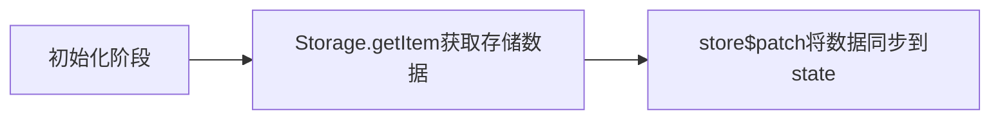
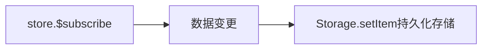
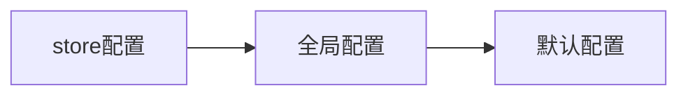

> 嘿JYM大家好，好久不见甚是想念. 不知道大家都用上vue3的全家桶，反正我没有，在公司还是vue2一把梭。不过为了跟得上速度，花了一点把文档给仔细翻阅了一遍，同时了解了一下如何实现一个Pinia插件，为了巩固了解如何实现一个插件,找了github开源的一个持久化存储的插件`pinia-plugin-persistedstate`来学习,也把相关源码看完并对其进行了流程绘制和实现总结。希望这篇文章能够给你的学习带来帮助

## Pinia-Plugin-Persistedstate
简单介绍一下：[pinia-plugin-persistedstate](https://prazdevs.github.io/pinia-plugin-persistedstate/zh/)是一个`pinia`状态同步存储的一个插件，可以自定义存储方式，自定义序列化配置和存储目标，并且可以对每个`store`进行单独配置。

## 实现逻辑分析图


可以停留下放大图片多看几眼，接下来带大家动动手一起实现一下(**如果看不懂，可能是我画的图太烂了...**)
> 温馨小提示：本文希望你在看完[Pinia官网插件章节](https://pinia.vuejs.org/zh/core-concepts/plugins.html)的知识再来阅读更合适，同时动手实现可以加强巩固知识点

## 核心原理
我们知道`pinia`提供了一个全局的状态管理，而`pinia-plugin-persistedstate`核心原理是使用特定的`Storage`(**如浏览器的`localStorage`，`sessionStorage`等API**)来存储`Pinia`状态，使得页面刷新或者关闭后，重新打开页面状态人能够被恢复, 主要使用的`Pinia`的两个核心API:

- `store.$patch` 将相关数据设置到state进行状态恢复
- `store.$subscribe` 在`state`被修改时同步数据到指定存储里


#### 初始阶段



#### 数据检测阶段



## 简单实现
那么接下来我们根据以上的步骤明确我们的目标简单实现`指定相关模块持久化存储到localStorage`,以下基于`vite`创建一个`vue` + `typescript`项目(你也可以创建一个非`ts`)

> 由于代码存在相关的typescript类型声明，有些朋友可能没用过，不过可以先忽略其类型声明聚焦在具体逻辑实现上，但还是希望你能够学一下相关知识，毕竟ts确实太好用了

**目录列表**
```
├── stores
│   ├── index.ts
│   ├── plugins
│   │   └── persistedstate
│   │       ├── index.ts
│   │       ├── types.d.ts
│   │       └── utils.ts
```
**在`stores/index.ts`内创建`pinia`实例并导出**
``` 
  // stores/index.ts
  import { createPinia } from "pinia";
  const pinia = createPinia();
  export default pinia;
```
依据官方所描述的，`Pinia`插件是一个函数，提供了`context`参数，`context`包含以下内容，而我们主要使用到`store`和`options`
- pinia：`createPinia()` 创建的 `pinia`
- app:   用 `createApp()` 创建的当前应用(仅 Vue 3)
- store: 该插件想扩展的 store 
- options: 定义传给 `defineStore()` 的 store的对象

我们根据上文的流程先初步实现一下：

1. 依据某个定义的某个`store`设置配置`persist`,这样我们就可以在插件中的`options.persist`来判断是否需要持久化存储
``` typescript
defineStore({
    // ...
    persist: true
})
// or
defineStore(() => {
 // ...
}, { persist: true })
```
2. 进入到`stores/plugins/persistedstate/index.ts`创建一个名为`createPersistedState`的函数并返回一个插件函数`(返回一个插件函数的原因是后面我们可以基于该工厂函数设置默认全局参数)`

``` typescript
// persistedstate/index.ts
import { PiniaPluginContext, StateTree, Store } from "pinia";

// 这块声明主要是为了能够支持typescript类型提醒，拓展store的参数
declare module "pinia" {
  export interface DefineStoreOptionsBase<S, Store> {
    persist?: boolean | PersistedStateOptions;
  }
}

export default function createPersistedState() {
  return (context: PiniaPluginContext) => {
    // option可以获取到persist
    const { options, store } = context;
    const { persist } = options;
    // 判断persist, falsy值直接退出
    if (!persist) return;
    // 解析同步到state
    // $store.id：获取store的唯一标识符从storage获取数据并注入state
    hydrateStore(store, store.$id);

    // 监听数据变化
    store.$subscribe(
      (mutation, state) => {
        // 持久化存储状态
        // 以store.$id作为key，将数据存储到stroage
        persistState(state, store.$id);
      },
      {
        // 组件销毁时，当前监听不会被销毁
        detached: true,
      }
    );
  };
}

// 解析数据同步到state
function hydrateStore(store: Store, key: string) {
  const fromStorage = localStorage.getItem(key);
  if (fromStorage) {
    try {
      store.$patch(JSON.parse(fromStorage));
    } catch (err) {
      console.error(err);
    }
  }
}
// 序列化之后存储到storage
function persistState(state: StateTree, key: string) {
  try {
    localStorage.setItem(key, JSON.stringify(state));
  } catch (err) {
    console.error(err);
  }
}

// 使用伪代码
// pinia.use(createPersistedState())
// const useXXStore = defineStore({
//       state: ()=> ({}),
//       persist: true
// })


```
### [github分支： base](url)

> 你可以复制以上代码到插件文件里面，尝试一下，或者到我的`github`克隆一下项目通过一个小todolList demo来进行理解。每实现一个小功能都会新增一个分支方便你切换查看


## 功能拓展
上面的代码已经完成我们的核心功能，但也并不满足我们业务需求的情况，所以我们进一步对`perisit`进行拓展

### 情景需求
1. 【key】 有时候我们可能不想使用`defineStore(key, options)`的`key`作为持久化存储的key，希望可以自定义或者添加前/后缀
2. 【storage】 我们并不想使用`LocalStorage`来持久化存储，可能想使用`SessionStorage`在关闭窗口或标签页之后将会删除这些数据，又或者自定义`Storage`(自主实现包含类localStorageAPI)进行相关存储
3. 【paths】 只是挑出某个`state`中指定的对象属性
4. 【serializer】 自定义序列化/反序列化数据逻辑设置其存储或者`store`
5. 【beforeRestore, afterRestore】 在**store同步前后**提供相关Hook控制
6. 【debug】 持久化/恢复 Store 时可能发生的任何错误都将使用 `console.error` 输出
7. 【Array数组对象类型的persiste】有一些数据想存储在`localStorage`,一些存储在`sessionStorage`, 比如如下场景：
```typescript
defineStore('xxx', {
    state:() => {
       return {
           a: {
               b: {
                  c: {
                    d: 4444,
                  },
                },
               f: {
                 g: 343,
               },
            }
        }
    },
    persist: [
        {
            // 存储到sessionStorage
            paths: ["a.b.c.d"],
            storage: sessionStorage
        },
        {
            // 存储到localStorage
            paths: ["a.f.g"],
            storage: localStorage
        }
    ]
})
```

### perisite拓展

由于我们在基础实现中是以`boolean`来判断是否存储的，所以我们需要对其进行类型扩展:
- 支持Object 根据对象类型，根据相关情景需求自定义设置某个配置
- 支持Object[] 支持情景需求第7种情况

下面我们`persiste`的参数选项进行拓展类型
``` typescript
// persistedstate/utils.ts
// 该方法首先对传入的第一个对象进行规范化成对象赋值到options
// 紧接着返回一个代理对象，如果options获取不到值，则从第二个参数globalOptions进行获取，key除外
// example： 
// true -> {}
// object -> [object]
// [object] -> [object]
export function normalizeOptions(options: boolean | PersistedStateOptions, globalOptions: PersistedStateFactoryOptions): PersistedStateOptions {
  options = (typeof options === "boolean" ? Object.create(null) : options) as PersistedStateOptions;
  return new Proxy(options, {
    get(target, key, receiver) {
      if (key === "key") {
        return Reflect.get(target, key, receiver);
      }
      return Reflect.get(target, key, receiver) || Reflect.get(globalOptions, key, receiver);
    },
  });
}

```
``` typescript
// persistedstate/index.ts
export default function createPersistedState() {
  return (context: PiniaPluginContext) => {
    const { options, store } = context;
    const { persist } = options;
    if (!persist) return;
    // normalizeOptions 看下文放在了 utils.ts
    // 由于需要支持Array和object，我们统一将其转换成Array方便后面处理
    // 这个方法你可以理解为persist类型进行参数规范化，同时在第一个
    // 参数获取不到值时到第二个参数获取，由于还没考虑到全局配置，这里先忽略normalizeOptions的第二个参数
    let persistOptions = (Array.isArray(persist) ? persist.map((p) => normalizeOptions(p, {})) : [normalizeOptions(persist, {})]).map((option) => {
      // 如果外部对persist设置的对象参数中存在空值的进行默认设置
      const {
        // 默认以localStorage为存储方式
        storage = localStorage,
        beforeRestore,
        afterRestore,
        // 默认以JSON的方法序列化和反序列化
        serializer = {
          serialize: JSON.stringify,
          deserialize: JSON.parse,
        },
        // 默认存储的key为定义defineStore的第一个参数
        key = store.$id,
        paths,
        debug = false,
      } = option;
      return {
        storage, beforeRestore, afterRestore, serializer, key, paths, debug
      };
    });

    // 遍历persist数组进行数据同步
    persistOptions.forEach((option) => {
      const { beforeRestore, afterRestore } = option;
      // 在同步数据时调用前置钩子
      beforeRestore?.(context);
      // 解析同步到state
      hydrateStore(store, option);
      // 同步结束后调用后置钩子
      afterRestore?.(context);

      store.$subscribe(
        (_mutation, state) => {
          persistState(state, option);
        },
        {
          detached: true,
        }
      );
    });
  };
}

```
解释一下以上代码：
- 为了`persist`能够支持传入`Boolean`,`Object`,`Array`,我们在拿到其参数非`Falsy`值之后，对其转换成最终的Array(内部包含多个Object配置选项)，经过`normalizeOptions`转换之后再遍历一次配置，将为空的配置选项进行默认设置,最终配置对象包含`storage, beforeRestore, afterRestore, serializer, key, paths, debug`

- 由于我们最终生成的配置是一个数组，所以我们需要将之前的数据检测同步到`state`的代码进行调整，改成遍历方式；与此同时我们直接传入`option`配置对象到`hydrateStore`和`persistState`可以通过外部传入自定义。**也就是不再写死`storage`和序列化和反序列化处理**
``` typescript
// persistedstate/index.ts
// 解析数据同步到state
function hydrateStore(store: Store, option: Persistence) {
  const { storage, serializer , debug} = option;
  const fromStorage = storage.getItem(option.key);
  if (fromStorage) {
    try {
      store.$patch(serializer.deserialize(fromStorage));
    } catch (error) {
      // 当设置debug为true时，打印出错误
      if (debug) console.error(error);
    }
  }
}
// 序列化之后存储到storage
function persistState(state: StateTree, optons: Persistence) {
  const { storage, serializer, debug } = optons;
  try {
    storage.setItem(optons.key, serializer.serialize(state));
  } catch (error) {
    // 当设置debug为true时，打印出错误
    if (debug) console.error(error);
  }
}
```
这样我们基本完成了`storage`,`serializer`,`debug`,`beforeRestore`,`afterRestore`,剩余`key`和`paths`。由于到时候在全局参数配置时也要介绍`key`参数，所以放到后面再讲，先来完成`paths`的实现逻辑

首先我们先确认下我们的目标【从某对象中取出某个对象属性】
``` typescript
// 伪代码
// state对象
const state = {
    a: {
       b: {
          c: {
            d: 4444,
          },
        },
       f: {
         g: 343,
       },
    },
}
// 检出指定某个属性
// 取出obj对象中的c属性
const paths = ['b.c.d', '....']
const result = pick(state, paths)
// 结果： { a: { b: { c: { d: 444 } } } }
```
实现一下该方法
``` typescript
// persistedstate/utils.ts
function pick(state, paths) {
  // 创建一个空对象来进行设置
  return paths.reduce((prev, path) => {
    const pathArr = path.split(".");
    return set(prev, pathArr, get(state, pathArr));
  }, {});
}

// 从对象中获取相应的属性值
// 从对象中根据path遍历paths依次获取值，直至最后一个path并返回
function get(state, paths) {
  return paths.reduce((prev, path) => {
    return prev?.[path];
  }, state);
}

// 给指定对象设置某个属性下的值
function set(state, paths, value) {
  // slice(0,1)只需要遍历前面的path值填充即可，后面再给最后一个path设置值
  const res = paths.slice(0, -1).reduce((prev, p) => {
    // 开始直接从state取到值，接下来的每一次根据path是否存在对应的值，有直接引用赋值，不存在时直接创建一个空对象并返回，这里可能比较不好理解，可以用几个数据测试一下有助理解
    return (prev[p] = prev[p] || {});
  }, state);
  // 给最后的一个path进行设置值并返回
  res[paths[paths.length - 1]] = value;
  return state;
}
```
这样我们就实现了一个**从对象中获取指定属性**，回到`persistState`重新调整一下逻辑
``` typescript
// persistedstate/index.ts
// 同步到指定存储空间
function persistState(state, option) {
  const { paths, storage, serializer, key, debug } = option;
  try {
    // 在其位置判断是否传入paths进而过滤选出需要存储的数据，否则直接整个state进行储存
    const result = Array.isArray(paths) ? pick(state, paths) : state;
    storage.setItem(key, serializer.serialize(result));
  } catch (error) {
    if (debug) console.error(error);
  }
}
```
### [github分支： options](url)


### 全局参数
由于我们除了`key`属性，其他功能基本都实现了一遍，现在新增一个全局参数设置主要目的是为了不需要为每一个定义的store进行配置，如果不配置默认读取**全局配置和默认配置**进行设置即可(**key比较特殊**)。有特殊场景需要给指定`store`不同配置，直接到目标`store`配置即可，以下是配置读取的优先级关系:


关于全局参数支持如下：
- 默认都持久化存储，`storage`默认存储方式，默认序列化和反序列化方式，默认添加`beforeRestore`和`afterRestore`钩子
- 对给每一个`store`的`key`进行重写或者添加前缀后缀

在前面你应该知道我们把函数写成了一个工厂函数目的就是为了传入全局参数`globalOptions`对象并返回一个插件函数，支持全局参数传入的有以下几个：
1. key 函数（必须返回一个新的key值）
2. storage
3. serializer
4. beforeRestore
5. afterRestore
6. auto 根据true 或者 false 判断默认是否需要持久化存储

实际上除了`key`和`auto`，其他的我们都在`store`配置实现了，剩下的工作只是在于`store`配置没有设置的时候直接从`globalOptions`中取即可。还记得我们之前的`normalizeOptions`的第二个参数吗？我们只需要将`{}`替换成`globalOptions`即可。

- auto: 对于默认全局配置，我们只需要在`globalOptions`中获取`auto`并设置到`persist`中即可
```typescript
// persistedstate/index.ts
export default function createPersistedState(globalOptions) { 
    // 默认每一个都不要持久化存储
    const { auto = false } = globalOptions
    return (context: PiniaPluginContext) => { 
        const { options, store } = context; 
        // 设置到persist默认值即可
        const { persist = auto } = options; 
        // ...
}
```
- key: 对`store`构建`key`的时候，判断是否传入全局的`key函数`，是直接处理，否则创建一个默认`key函数`返回从`store`配置的`key`或者默认的`store.$id`
```typescript
// persistedstate/index.ts
let persistOptions = (Array.isArray(persist) ? persist.map((p) => normalizeOptions(p, globalOptions)) : [normalizeOptions(persist, globalOptions)]).map((option) => {
  const {
    key = store.$id,
    // ...
  } = option;
  // 创建一个默认的key函数返回key的默认值(store.$id)
  const defualtKeyFn = (k) => k;
  // 如果有传入全部key函数，则将由全局key函数处理并返回
  const key = globalOptions.key ? globalOptions.key(key) : defaultKeyFn(key)
  return {
    key,
    // 其他配置参数...
  };
});
```
### [github分支： globalOptions](url)


### 其他
可能有些朋友有看过`pinia-plugin-persistedstate`的源码发现，还差`$persist`和`$hydrate`呀，其实这并没有什么难度，在这里可以让其他朋友自行实现一下(没错，我太懒了哈哈哈)，或者到github查看下官方实现，在这里就不展开讲了了~嘿嘿。


## 总结
以上就是一个持久化存储插件的实现，其实只是用到`pinia`插件提供的`context`的几个方法的使用就实现了，关于其他的使用那就看各位的大展身手了。最后的最后也非常感谢各位能看完，希望能够对大家有帮助，期待在未来能够使用到在座各位的插件 😃。